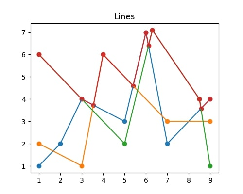

# upper-envelope

Code for calculating the upper envelope of a set of linear approximation functions described by points.

My algorithm is implemented using, among other tricks, a lightweight interpolation with optimisations which improves the expected calculation time by ~30%. The time complexity is $O(n^2)$, and this is the fastest algorithm I know to solve this variant of the upper envelope problem.



The plot describes the problem nicely. The red line is the **upper envelope** of the set of three functions (blue, orange and green). It is guaranteed that all functions' domain is the same (the starting and ending points have the same X-coordinate).

### C++ notice

As connecting C++ and Python turned out to be more difficult than expected, the functions have been completely rewritten to Python. The new file structure became easier to read and maintain. C++ version is now in `/cpp` along with the required i/o files.

### Example

```python
import gen_data
import plot_data
import envelope as ev
from converter import tuplelines2lines

generated_lines = gen_data.gen_random_data()
upper_envelope = ev.get_ue(tuplelines2lines(generated_lines))

plot_data.plot_nice_picture(generated_lines, upper_envelope)
```
